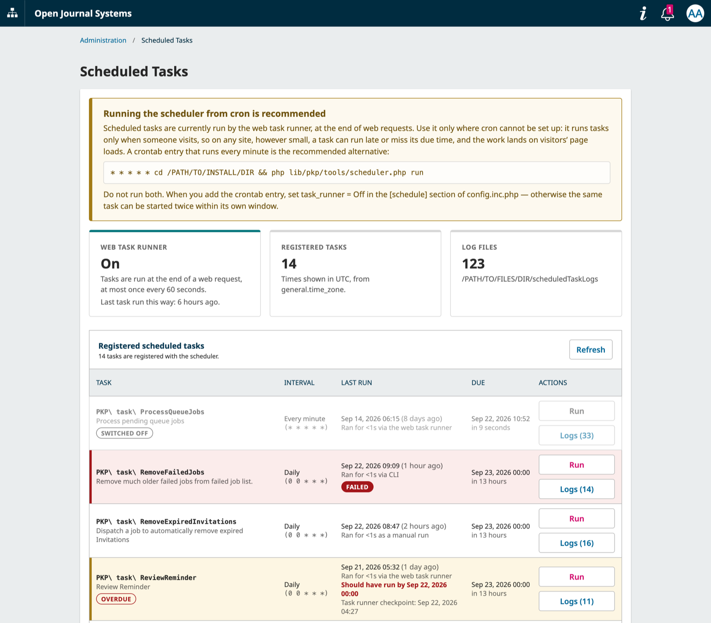

# Scheduled Task Manager

A site-administration page for the scheduled tasks of OJS, OMP and OPS 3.5 — for
site administrators who cannot run `lib/pkp/tools/scheduler.php` on the server.

## Screenshot



*A failed task (red, with the **Failed** badge that opens its details) and an overdue task (amber).*

## Features

- **Every registered task** — core, application and plugin tasks, exactly as
  `scheduler.php list` sees them — with its interval, cron expression and next due time.
- **Last run**, how long it took, and what ran it: the web task runner, the CLI (cron, or someone
  running the scheduler by hand), or a manual run.
- **Failed** tasks are shaded red. The **Failed** badge opens the details: the exception and its
  stack trace, or, for a task that reported its own failure, what it wrote to its log during
  that run.
- **Overdue** tasks — ones that missed a scheduled run — are shaded amber.
- **Run a task now**, after a confirmation. A task switched off by its own conditions (such as
  `ProcessQueueJobs` without `queues.process_jobs_at_task_scheduler`) or already running is refused.
- **Execution logs** per task: sort by start or duration, filter by date and duration, download,
  and delete old ones.
- **Scheduler status** at a glance: whether the web task runner is on, the timezone times are
  shown in, and the log directory — with a reminder to run the scheduler from cron. Use the web
  task runner only where cron cannot be set up: it runs tasks only when someone visits, so on any
  site, however small, a task can run late or miss its due time, and its work lands on a
  visitor's page load.

## How it works

- **Last run** is the more recent of two sources: the plugin's own record, kept by listening to
  the scheduler's events (so it starts when the plugin is enabled), and the task's newest log
  file, which reaches back further but cannot say how a run went or what ran it.
- **Success or failure** is read from the exit code the scheduler leaves on the task, not from
  which event fired: core's tasks that can fail (`UpdateIPGeoDB`, `UpdateRorRegistryDataset`, the
  usage statistics loader, `DOAJInfoSender`) report it by returning `false`, which the scheduler
  still announces as "finished".
- **Only each task's latest failure is kept**, and its next success clears it. Traces and log
  excerpts are size-limited and shown to site administrators only.
- The web runner's own **checkpoint** (3.5.0-6 and later) is shown only when it disagrees with
  the last real run — the case worth a look when a task seems never to run.

## Requirements

- OJS, OMP or OPS 3.5.0-4 or later — earlier 3.5.0 releases lack the hook plugins use to add
  their own API, so the page cannot load its data there
- PHP 8.2 or later

## Installation

Download the packaged plugin from the releases and upload it from the Plugins page, or install it
from the plugin gallery once it is listed there. To install from a git checkout instead, clone it
into `plugins/generic/scheduledTaskManager` and run:

```bash
php lib/pkp/tools/installPluginVersion.php plugins/generic/scheduledTaskManager/version.xml
```

Then enable it:

- **More than one journal, press or server:** Administration → Site Settings → Plugins.
- **Exactly one:** that journal's Settings → Website → Plugins, which needs the Manager role —
  core hides the site-level tab on single-context installations.

The page is at Administration → Scheduled Tasks, for site administrators only.

## Notes

- The log directory is flat and unbounded — an every-minute task writes 1,440 files a day — so
  reading it is the plugin's main cost. The page reads only what it needs; delete old logs from a
  task's Logs view.
- Core names log files after the task's class without its namespace, so two tasks sharing a
  class name share log files.

## License

Copyright (c) 2026 Touhidur Rahman

Distributed under the GNU GPL v3. For full terms see the file `LICENSE`.
